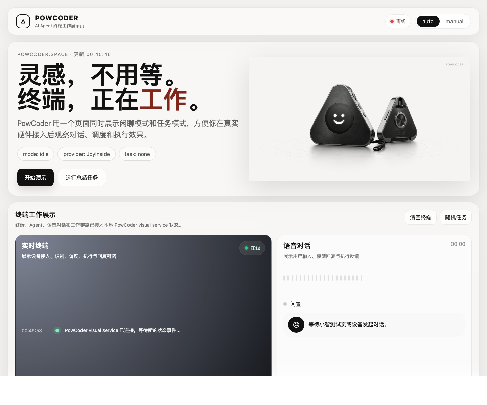

# CodePower AI — 语音版多 Agent 工作终端

CodePower AI 把小智语音入口、任务调度、可配置 Agent 后端和可视化状态页串起来。仓库默认提供一套通用基线:任务模式默认走 `Hermes`，同时启用 `OpenClaw`，并内置 `planner / executor` 两个通用分身，方便开箱联调。

硬件目标是装在充电宝里的随身 coding 助手。开发和演示阶段可以用浏览器测试页模拟麦克风。

```text
麦克风 / 浏览器测试页
   │ WebSocket(opus)
   ▼
xiaozhi-esp32-server(8000 / 8003)
   │ MCP streamable-http
   ▼
CodePower dispatcher(127.0.0.1:9001)
   ├── 可配置任务后端
   ├── 本机 Codex CLI / Claude Code CLI
   ├── chat 模式直连 JoyInside voiceChat
   ├── JoyInside skill gateway 入站回调(可选,127.0.0.1:9100)
   └── PowCoder visual dashboard(127.0.0.1:9200)
```

## 技术栈

| 层 | 选型 | 说明 |
|------|------|------|
| 运行环境 | Python 3.10 venv(uv 管理) | ARM64 原生 |
| ASR | FunASR / SenseVoiceSmall | 中文识别,首次下载约 900MB |
| LLM | 任意 OpenAI 兼容 + function_call | 可换成自己的中转、OpenRouter、自建 vLLM |
| Intent | function_call | 复用主 LLM |
| TTS | EdgeTTS | 默认中文女声 |
| MCP | streamable-http(`mcp>=1.22`) | 官方 Python SDK |
| 任务后端 | 用户配置 | 通过环境变量和 `dispatcher/server.py` 适配 |
| 可视化 | Starlette + 静态前端 | 展示会话、任务、worker 状态 |

## 快速开始

### 1. 克隆和安装

```bash
git clone <THIS_REPO_URL> codepower-ai
cd codepower-ai
./scripts/setup.sh
```

安装脚本会:

- 克隆 `xinnan-tech/xiaozhi-esp32-server` 到 `repo/`
- 创建 `repo/main/xiaozhi-server/.venv/`
- 创建 `dispatcher/.venv/`
- 把 `data/.config.yaml` 和 `.mcp_server_settings.json` 软链到小智 server 的 data 目录
- 拷贝 `data/.config.yaml.example` 到 `data/.config.yaml`

### 2. 配置环境变量

```bash
cp .env.example .env
```

至少需要配置:

```bash
CODEPOWER_LLM_API_KEY=
```

如需 ASR/TTS 或 JoyInside 能力,继续补齐 `.env.example` 中对应变量。`.env` 已被 `.gitignore` 忽略,不要提交真实密钥。

### 3. 配置任务 Agent

默认配置已经包含:

```bash
CODEPOWER_AGENT_BACKEND=hermes
CODEPOWER_AGENT_BACKENDS=hermes,openclaw
CODEPOWER_DEFAULT_AGENT=planner
CODEPOWER_AGENT_REGISTRY=planner:任务规划,executor:任务执行
```

如果你有自己的分身或后端,直接在本地 `.env` 覆盖即可。`dispatch_agent(agent_id, task, backend)` 负责统一入口和状态写入;具体后端适配放在 `dispatcher/server.py`。

### 4. 启动

```bash
./scripts/start.sh
# 看日志
./scripts/logs.sh
# 停止
./scripts/stop.sh
```

首次启动会自动下载本地 ASR 模型。

### 5. 测试

```bash
cd dispatcher
source .venv/bin/activate

# dispatcher 自身
python3 test_client.py list
python3 test_client.py call list_agent_backends
python3 test_client.py call list_agents

# 端到端 WebSocket
python3 test_xiaozhi_ws.py "列出所有可用的 agent"
python3 test_xiaozhi_ws.py "讲个很短的故事" chat
```

浏览器测试页:

```bash
python3 -m http.server 8006 --directory repo/main/xiaozhi-server/test
open http://127.0.0.1:8006/test_page.html
```

本机浏览器测试时,OTA 地址填:

```text
http://127.0.0.1:8003/xiaozhi/ota/
```

## PowCoder 可视化状态页

可视化页不是独立聊天入口,而是读取本地状态文件和事件流,展示当前对话与任务执行效果。

```bash
./scripts/start_powcoder_visual.sh
open http://127.0.0.1:9200/
```

页面当前按模式分区:

- **闲聊模式**:JoyInside 独立展示,用于聊天、故事、陪伴式能力。
- **任务模式**:Hermes、OpenClaw、dispatcher、Codex、Claude Code 和项目自定义 worker 都归入任务模式。

本地接口:

```text
GET /api/state
GET /api/events
GET /api/sessions
```

演示截图:



## JoyInside 接入

JoyInside 在本项目里有两条链路:

1. **chat 模式出站调用**:小智 server 直连 JoyInside voiceChat,用于闲聊、讲故事、游戏等能力。
2. **入站 skill gateway**:JoyInside 云端调用本地 `joyinside_gateway`,再转到 CodePower dispatcher 工具。

### 出站 chat 模式

`.env`:

```bash
JOYINSIDE_ACCESS_KEY=
JOYINSIDE_SECRET_KEY=
JOYINSIDE_VENDOR_ID=
JOYINSIDE_APP_ID=
JOYINSIDE_DEVICE_ID=codepower-local-xiaozhi
JOYINSIDE_DEVICE_NAME=CodePower-Local-Xiaozhi
JOYINSIDE_BOT_ID=
JOYINSIDE_UID=codepower-local-user
```

验证:

```bash
cd dispatcher
source .venv/bin/activate
python3 test_xiaozhi_ws.py "讲个很短的故事" chat
```

### 入站 skill gateway

本地启动:

```bash
JOYINSIDE_SERVICE_TOKEN=dev-token ./scripts/start_joyinside_gateway.sh
```

本地测试:

```bash
curl -N -X POST 'http://127.0.0.1:9100/joyinside/skill?tool=list_agents' \
  -H 'Authorization: Bearer dev-token' \
  -H 'Content-Type: application/json' \
  -d '{"parameters":{"input":"列出所有可用 agent","session_id":"local","bot_id":"local"}}'
```

JoyInside 云端要调用本地 gateway 时,需要公网 HTTPS。可以用 Cloudflare Tunnel 或正式部署:

```bash
cloudflared tunnel --url http://127.0.0.1:9100
```

## MCP 工具

`http://127.0.0.1:9001/mcp` 暴露的核心工具:

| 工具 | 用途 |
|------|------|
| `list_agents()` | 列出当前可派发的分身 |
| `list_agent_backends()` | 查看 Hermes / OpenClaw 等任务后端配置 |
| `dispatch_agent(agent_id, task, backend)` | 默认走 Hermes 派发任务,也可显式指定 OpenClaw |
| `query_agent_status()` | 查询最近任务状态 |
| `read_daily_report(date)` | 读取本地日报 |
| `openclaw_agent_task(agent_id, task)` | 显式调用 OpenClaw Gateway agent |
| `hermes_repo_task(task)` | 显式调用 Hermes 工程任务后端 |
| `run_codex(task, workdir, allow_edits)` | 调本机 Codex CLI |
| `run_claude_code(task, workdir, allow_edits)` | 调本机 Claude Code CLI |

如需接入新的后端或平台,在 `dispatcher/server.py` 增加适配函数和 `@mcp.tool()` 即可。当前默认基线是 Hermes + OpenClaw,但你可以在本地覆写。

## 目录结构

```text
codepower-ai/
├── README.md
├── data/
│   ├── .config.yaml.example
│   ├── .config.yaml
│   └── .mcp_server_settings.json
├── dispatcher/
│   ├── server.py
│   ├── test_client.py
│   └── test_xiaozhi_ws.py
├── joyinside_gateway/
├── powcoder_dashboard/
├── powcoder_visual/
├── powcoder_visual_service/
├── repo/
└── scripts/
```

## 关键配置点

1. LLM 必须支持 function calling,否则 task 模式不会触发工具。
2. `tool_call_timeout` 建议保持 300 秒以上,长任务后端可能需要时间。
3. `.env` 和 `data/.config.yaml` 是本地配置,不要提交真实密钥或私人 agent 设定。
4. prompt 里只写通用工具和路由规则。具体 agent 名称、角色、人设应该由部署方在本地配置。
5. chat 模式和 task 模式分开:chat 走 JoyInside;task 走 dispatcher 和任务后端。

## License

MIT。本仓库依赖项目各自遵循其原 license。
